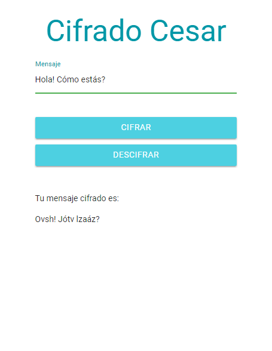

# Cifrado César

>El cifrado César, tambien conocido como cifrado por desplazamiento, es un tipo de cifrado por sustitución en el que una letra en el texto original es reemplazada por otra que se encuentra un número fijo de posiciones más adelante en el alfabeto.

Para este proyecto, la web trabaja con **33 espacios hacia la derecha**.

Por ejemplo:

- Texto original: `ABCDEFGHIJKLMNOPQRSTUVWXYZ`
- Texto codificado: `HIJKLMNOPQRSTUVWXYZABCDEFG`

Al ingresar a la página, se solicita al usuario ingresar un mensaje en un input, y luego se ofrecen las opciones de cifrado o descifrado mediante botones.

El resultado de la conversión del texto se mostrará en la parte inferior.

## Especificaciones

- El input admite todos los caracteres.
- Solo se realizan el cifrado o descifrado de letras mayúsculas o minúsculas sin tildes.
- Los demás caracteres se mostrarán tal cual en el resultado, como se puede ver en la imagen de ejemplo.

## Herramientas utilizadas

- Materialize
- Javascript ES6
- jQuery
- HTML5
- CSS3